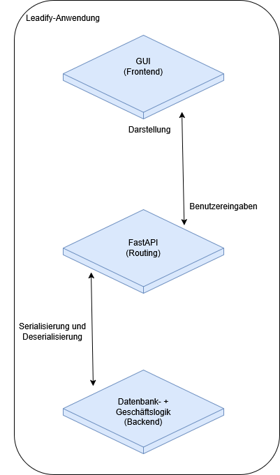

## Technische Architektur von Leadify

Leadify basiert auf einer klar strukturierten Drei-Schichten-Architektur, bestehend aus Frontend, API-Schicht (FastAPI) und Backend (Geschäftslogik und Datenbankzugriff).
Die persistente Datenspeicherung erfolgt über eine relationale MariaDB-Datenbank, welche über standardisierte SQL-Abfragen angesprochen wird und unabhängig von der Anwendung mit gängigen Verwaltungstools gepflegt werden kann.

Zu Beginn des Projekts bestand keine klare Trennung zwischen Frontend und Backend. Die Flet-Anwendung griff direkt auf die Datenbank zu, wodurch Präsentationslogik und Datenzugriff eng miteinander gekoppelt waren.

Im Verlauf der Entwicklung wurde die Architektur gezielt in ein Drei-Schichten-Modell überführt, um insbesondere Wartbarkeit, Skalierbarkeit und Erweiterbarkeit zu verbessern.
Hierbei wurde FastAPI als zentrale Schnittstelle zwischen Frontend und Backend eingeführt.

---

### Kommunikationsstruktur

Das Frontend ist für die Darstellung der Benutzeroberfläche sowie die Verarbeitung von Benutzereingaben verantwortlich.
Die Kommunikation mit dem Backend erfolgt ausschließlich über die FastAPI-Schnittstelle mittels HTTP-Anfragen im JSON-Format.

Die API-Schicht (FastAPI) übernimmt dabei folgende Aufgaben:

- Entgegennahme und Validierung von Anfragen
- Serialisierung und Deserialisierung von Daten (JSON ↔ Python-Objekte)
- Weiterleitung der Anfragen an die Backend-Logik
- Rückgabe der verarbeiteten Ergebnisse an das Frontend

Das Backend verarbeitet die eingehenden Anfragen innerhalb der Geschäftslogik. Diese ist in Form von sogenannten Manager-Klassen strukturiert (siehe Klassendiagramm).

Zu den zentralen Aufgaben gehören:

- Umsetzung der Geschäftsprozesse
- Durchführung von Datenbankoperationen
- Validierung von Benutzerrechten und Rollen

Beispielsweise wird überprüft, welche Benutzerrolle (z. B. Vertriebsmitarbeiter oder Abteilungsleiter) eine Anfrage stellt, um ausschließlich autorisierte Daten und Funktionen bereitzustellen.

---

### Schichtentrennung im Überblick

Die Architektur folgt einer klaren funktionalen Trennung:

- **Frontend**
Benutzeroberfläche und Interaktion (User Experience, Eingaben, Darstellung)

- **API-Schicht (FastAPI)**
Kommunikationsschnittstelle, Datenformatierung und Request-Verarbeitung

- **Backend**
Geschäftslogik, Datenverarbeitung und Datenbankzugriff

---

### Ausführliche Veranschaulichung mit Beispiel
Die praktische Umsetzung der beschriebenen Architektur wird exemplarisch im Abschnitt [Lead Status Modul](lead_status_doku.md) dokumentiert. Anhand dieses Moduls lässt sich der vollständige Kommunikationsweg – von der Benutzerinteraktion im Frontend über die FastAPI-Schnittstelle bis zur Datenbankabfrage im Backend – konkret nachvollziehen.