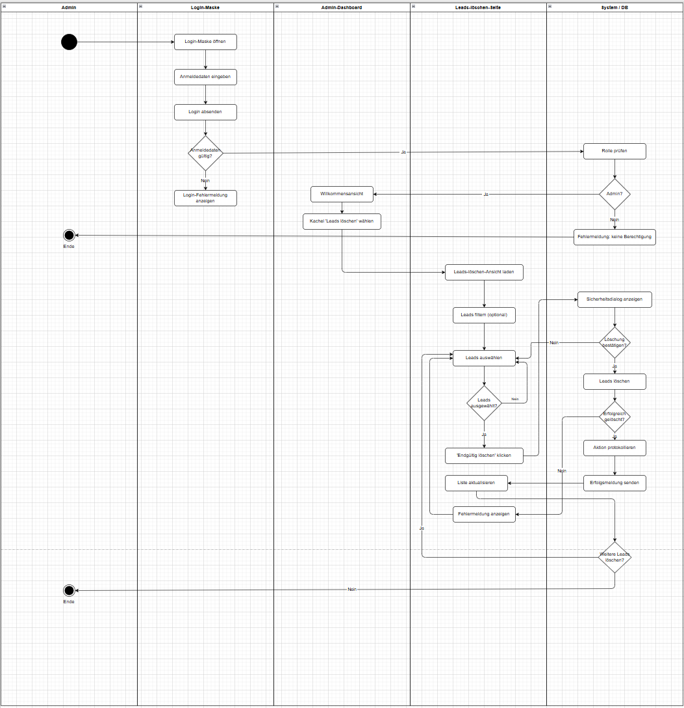

## Prozessbeschreibung: Login und Löschen von Leads

Das Diagramm zeigt den Ablauf vom Login eines Administrators bis zum Löschen von Leads im System.

### 1. Login-Prozess
Zu Beginn öffnet der Admin die Login-Maske und gibt seine Anmeldedaten ein.  
Nach dem Absenden wird geprüft, ob die eingegebenen Daten gültig sind.

- **Ungültige Daten:**  
  Es wird eine Fehlermeldung angezeigt und der Prozess endet.

- **Gültige Daten:**  
  Es erfolgt eine Rollenprüfung im System.

### 2. Rollenprüfung
Nach erfolgreichem Login wird überprüft, ob der Benutzer die Rolle **Admin** besitzt.

- **Kein Admin:**  
  Es wird eine Fehlermeldung („keine Berechtigung“) angezeigt.

- **Admin:**  
  Zugriff auf das Admin-Dashboard wird gewährt.

### 3. Navigation im Dashboard
Im Admin-Dashboard kann der Benutzer die Funktion **„Leads löschen“** auswählen.  
Daraufhin wird die entsprechende Übersicht geladen.

### 4. Auswahl der Leads
In der Leads-Übersicht:

- werden vorhandene Leads angezeigt  
- können ein oder mehrere Leads ausgewählt werden  

### 5. Löschvorgang
Vor dem endgültigen Löschen erfolgt eine Sicherheitsabfrage.

- **Abbruch:**  
  Der Vorgang wird beendet und keine Daten werden gelöscht.

- **Bestätigung:**  
  Die ausgewählten Leads werden gelöscht.

### 6. Systemreaktion
Nach dem Löschen:

- wird die Aktion im System protokolliert  
- wird eine Erfolgsmeldung angezeigt  

Falls ein Fehler auftritt:

- wird eine Fehlermeldung angezeigt  

### 7. Abschluss
Die Liste der Leads wird aktualisiert.  
Der Admin kann anschließend:

- weitere Leads löschen  
- oder den Prozess beenden 