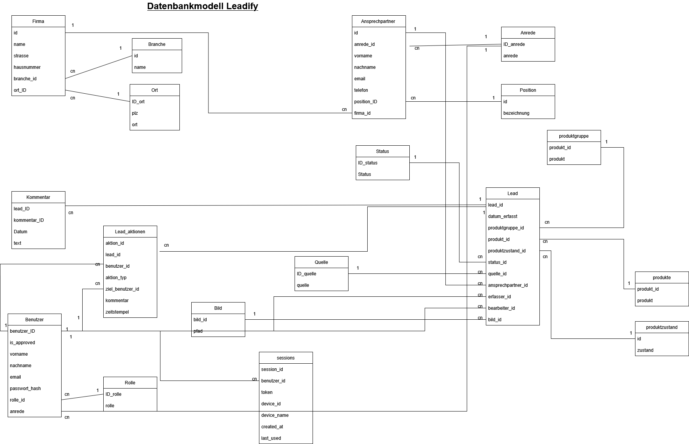

Das Datenbankmodell zeigt eine klar strukturierte, relationale Architektur, in der zentrale Entitäten wie Leads ihre Informationen aus mehreren normalisierten Tabellen beziehen.
Die Tabelle Lead fungiert dabei als zentrale Verknüpfungseinheit und enthält – abgesehen von ihrer Primärschlüssel-ID – überwiegend Fremdschlüssel, die auf andere Tabellen verweisen.

Zwischen der Lead-Tabelle und den angebundenen Tabellen bestehen überwiegend 1:n-Beziehungen (Eins-zu-Viele-Beziehungen). Das bedeutet, dass beispielsweise mehrere Leads auf denselben Datensatz einer ausgelagerten Tabelle (z. B. Status, Kunde oder Ort) referenzieren können. Diese Verknüpfungen werden über Fremdschlüssel realisiert und stellen sicher, dass nur gültige und konsistente Daten referenziert werden.

Durch die gezielte Auslagerung wiederverwendbarer Informationen in separate Tabellen und deren relationale Verknüpfung wird eine hohe Datenkonsistenz, Redundanzvermeidung sowie die Einhaltung zentraler Prinzipien der Datenbanknormalisierung erreicht. Änderungen an zentralen Stammdaten wirken sich dadurch automatisch auf alle verknüpften Leads aus, ohne dass redundante Daten angepasst werden müssen.

Die Verwendung von Fremdschlüsseln gewährleistet zusätzlich die referenzielle Integrität, indem nur existierende Datensätze miteinander verknüpft werden können.