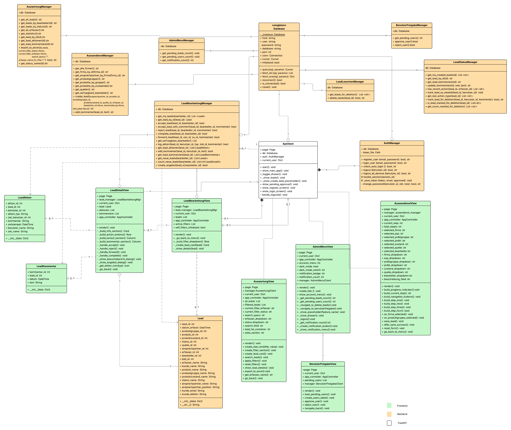

# Klassendiagramm

Im folgenden Klassendiagramm von **Leadify** sind die einzelnen Systemschichten farblich hervorgehoben.  
Dadurch wird die Architektur sowie die klare Trennung zwischen Frontend und Backend unmittelbar ersichtlich.

- **Frontend (grün):** Zuständig für die Darstellung der Benutzeroberfläche (Views)
- **Backend (orange):** Enthält die Geschäftslogik sowie die Datenverarbeitung
- **Schnittstelle:** Kommunikation erfolgt über die FastAPI-basierte API

Die sogenannten **Managerklassen** im Backend übernehmen die zentrale Steuerung der Geschäftslogik.  
Sie verarbeiten Anfragen, koordinieren Abläufe und stellen die Kommunikation mit der Datenbank sicher.

Im Frontend hingegen erfolgt ausschließlich die Darstellung und Interaktion mit dem Benutzer.  
Die sogenannten **Views** sind für die Visualisierung der Daten verantwortlich und greifen über die API auf das Backend zu.

Durch diese klare Trennung der Verantwortlichkeiten wird eine modulare, wartbare und erweiterbare Systemarchitektur gewährleistet.

---

