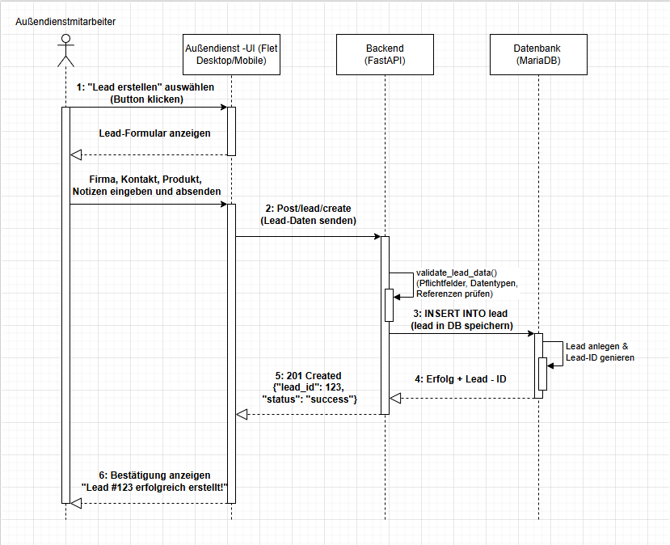

# Sequenzdiagramm

Dieser Abschnitt dient zur Dokumentation des UML-Diagramms.

## Zweck

Hier wird der Ablauf zwischen den beteiligten Komponenten beschrieben.

## Beteiligte Komponenten

- Außendienstmitarbeiter
- Frontend (Außendienst-UI)
- Backend (FastAPI)
- Datenbank (MariaDB)

## Diagramm

## Erklärung

Dieses UML-Sequenzdiagramm zeigt den konkreten Ablauf der Erstellung eines neuen Leads innerhalb der Leadify-Anwendung und die Interaktion zwischen den beteiligten Komponenten.

### Beteiligte Akteure und Systeme

- **Außendienstmitarbeiter**: Der Benutzer, der einen neuen Lead erfasst.
- **Frontend (Außendienst-UI)**: Benutzeroberfläche zur Eingabe und Übergabe der Lead-Daten.
- **Backend (FastAPI)**: API-Endpunkt zur Verarbeitung und Übergabe an die Business-Logik.
- **Datenbank (MariaDB)**: Persistente Speicherung der Lead-Daten.

### Ablauf der Kommunikation

1. **Start der Aktion**: Der Außendienstmitarbeiter klickt im Frontend auf „Lead erstellen".
2. **Formularanzeige**: Das Frontend zeigt ein Eingabeformular an.
3. **Dateneingabe**: Der Benutzer erfasst die Felder und sendet das Formular ab.
4. **API-Anfrage**: Das Frontend sendet eine POST-Anfrage an `/aussendienst/leads` mit den Feldern `ansprechpartner_id`, `produkt_id`, `produktgruppe_id`, `produktzustand_id`, `quelle_id`, `erfasser_id` sowie optional `bearbeiter_id`, `beschreibung`, `bild_pfad`.
5. **Validierung**: FastAPI/Pydantic validiert die Request-Struktur und Datentypen anhand von `CreateLeadRequest`.
6. **Business-Logik und Insert**: Das Backend ruft `AussendienstManager.create_lead(...)` auf und führt `INSERT INTO lead` aus. Dabei wird `status_id` initial auf `1` gesetzt und `datum_erfasst` mit `NOW()` befüllt. Optional wird bei vorhandener Beschreibung zusätzlich ein Kommentar angelegt.
7. **Rückmeldung Backend**: Bei Erfolg liefert die API die Antwort `{ "success": true, "lead_id": <id> }` (HTTP 200). Bei Fehler wird eine Exception zurückgegeben.
8. **Anzeige im Frontend**: Das Frontend zeigt die Erfolgsmeldung an und kann den neuen Lead über die zurückgegebene ID weiterverarbeiten.

### Ergebnis

Der neue Lead wurde erfolgreich in der Datenbank gespeichert und steht für weitere Bearbeitungsschritte im System bereit.
