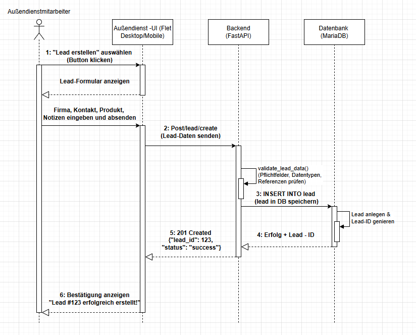
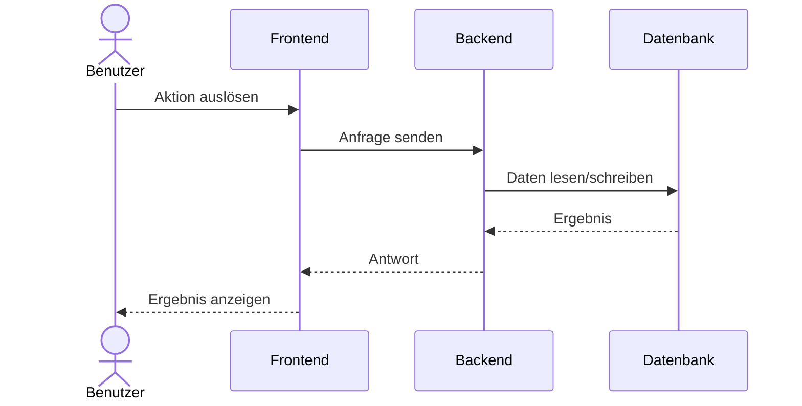

# UML Sequenzdiagramm

Dieser Abschnitt zeigt das Sequenzdiagramm fuer den Leadify-Ablauf und erklaert die einzelnen Schritte.

## Zweck

Das Diagramm visualisiert die Kommunikation zwischen Benutzer, Frontend, Backend und Datenbank bei einer typischen Aktion in der Anwendung.

## Beteiligte Komponenten

- Benutzer
- Frontend
- Backend
- Datenbank

## Sequenzdiagramm

## Erklaerung zum Diagramm

1. Der Benutzer loest im Frontend eine Aktion aus, zum Beispiel das Oeffnen oder Bearbeiten eines Leads.
2. Das Frontend sendet die Anfrage an das Backend, wo die Fachlogik ausgefuehrt wird.
3. Das Backend greift auf die Datenbank zu, um benoetigte Daten zu lesen oder zu speichern.
4. Die Datenbank liefert das Ergebnis an das Backend zurueck.
5. Das Backend sendet die aufbereitete Antwort an das Frontend.
6. Das Frontend zeigt das Ergebnis fuer den Benutzer an.

## Technischer Nutzen

- Macht die Verantwortlichkeiten der Systemteile klar.
- Hilft bei Debugging und Fehlersuche in Request/Response-Ketten.
- Dient als Grundlage fuer Erweiterungen und API-Dokumentation.

## Notizen

- Das oben eingebundene Bild stammt aus dem Projektordner und wurde in den Doku-Asset-Ordner uebernommen.
- Bei Aenderungen am Diagramm bitte die Bilddatei unter `docs/assets/images/UML_Diagramm.png` aktualisieren.
