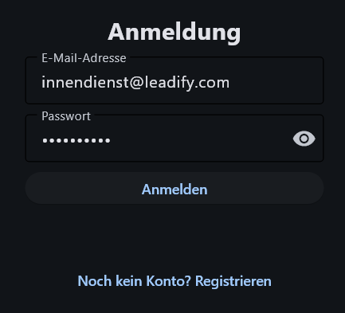
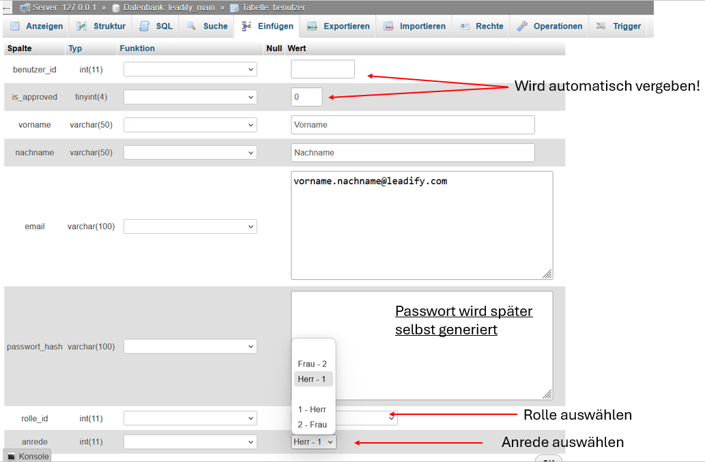
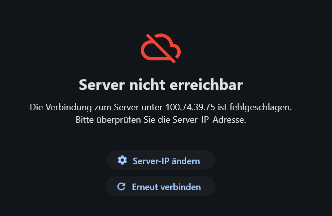

# 1. Registrierung & Login

Dieses Kapitel beschreibt den Anmeldeprozess sowie die Benutzerregistrierung innerhalb von Leadify.

# Anmeldung
In der Leadify-Datenbank sind standardmäßig vier Testbenutzer angelegt. Diese repräsentieren alle verfügbaren Rollen und Funktionsbereiche innerhalb der Anwendung.

??? abstract "Außendienstmitarbeiter (Lead-Erstellung und Zuweisung an Innendienst)"
    - **E-Mail:** ausendienst@leadify.com  
    - **Passwort:** ausendienst  

??? abstract "Innendienstmitarbeiter (Leads bearbeiten oder weiterleiten)"
    - **E-Mail:** innendienst@leadify.com  
    - **Passwort:** innendienst  

??? abstract "Abteilungsleiter (Leads auswerten und Reportings erstellen)"
    - **E-Mail:** auswertung@leadify.com  
    - **Passwort:** auswertung  

??? abstract "Administrator (Benutzer freigeben und Leads löschen)"
    - **E-Mail:** admin@leadify.com  
    - **Passwort:** adminadmin  

## Anmeldevorgang

Um sich als registrierter Benutzer anzumelden, geben Sie auf der Login-Seite die E-Mail-Adresse sowie das zugehörige Passwort ein.



Nach erfolgreicher Authentifizierung gelangen Sie in den für Ihre Rolle vorgesehenen Funktionsbereich.

---

# Registrierung

## Grundprinzip

Leadify ist für den unternehmensinternen Einsatz konzipiert.  
Daher können neue Benutzerkonten nicht frei erstellt werden, sondern müssen zunächst in der Datenbank angelegt werden.

Dieses Vorgehen stellt sicher, dass ausschließlich autorisierte Personen Zugriff auf interne Unternehmensdaten erhalten.

---

## Benutzer in der Datenbank anlegen

Ein neuer Benutzer wird innerhalb der Datenbank **„Leadify“** in der Tabelle **„Benutzer“** angelegt.



Folgende Felder sind zu befüllen:

### Pflichtangaben

- **Vorname**
- **Nachname**
- **E-Mail-Adresse**

### Rolle (`rolle_id`)

| Wert | Rolle                     |
|------|--------------------------|
| 0    | Administrator            |
| 1    | Vertriebsaußendienst     |
| 2    | Vertriebsinnendienst     |
| 4    | Abteilungsleiter         |

### Anrede (`anrede`)

| Wert | Bedeutung |
|------|-----------|
| 1    | Herr      |
| 2    | Frau      |

## Alternativ: Anlegen per SQL-Befehl

Ein Benutzer kann auch direkt per SQL-Statement angelegt werden:

```sql
INSERT INTO `benutzer`
(`benutzer_id`, `is_approved`, `vorname`, `nachname`, `email`, `passwort_hash`, `rolle_id`, `anrede`)
VALUES
('', '', 'Vorname', 'Nachname', 'vorname.nachname@leadify.com', 'NULL', '2', '1');
```

Die Werte für:

- vorname
- nachname
- email
- rolle_id
- anrede

sind entsprechend anzupassen.

---

## Passwortvergabe durch den Benutzer

Nachdem der Benutzer in der Datenbank angelegt wurde, kann dieser sein persönliches Passwort festlegen.

Dazu:

1. Öffnen Sie die Anwendung.
2. Wechseln Sie zur Registrierungsmaske.
3. Geben Sie die zuvor angelegte E-Mail-Adresse ein.
4. Legen Sie ein Passwort fest.

---


## Administratorfreigabe (Zweiter Sicherheitsmechanismus)

Nach erfolgreicher Registrierung muss das Benutzerkonto zusätzlich von einem Administrator freigegeben werden.
Dieser Schritt dient als zusätzlicher Sicherheitsmechanismus und stellt sicher, dass nur verifizierte Benutzer Zugriff erhalten.

Vorgehensweise:

1. Melden Sie sich mit einem Administrator-Konto an.
2. Öffnen Sie den Bereich zur Benutzerverwaltung.
3. Geben Sie den neu registrierten Benutzer frei.

Weitere Details finden Sie im Kapitel: [Admin Portal](6. Admin-Portal.md)

---

# Häufige Probleme



Tritt der Fehler **„Server nicht erreichbar“** auf, überprüfen Sie bitte folgende Punkte:

- Das Backend (uvicorn) wurde erfolgreich gestartet und ist von außen erreichbar.
- Die Leadify-Datenbank (MariaDB) läuft fehlerfrei im Hintergrund und ist für das Backend erreichbar.
- Die eingegebene IP-Adresse ist korrekt.
- Die Datei db_config.env enthält die richtigen Zugangsdaten.

Dieser Fehler tritt in der Regel auf, wenn keine Verbindung zwischen Frontend und Backend hergestellt werden kann.