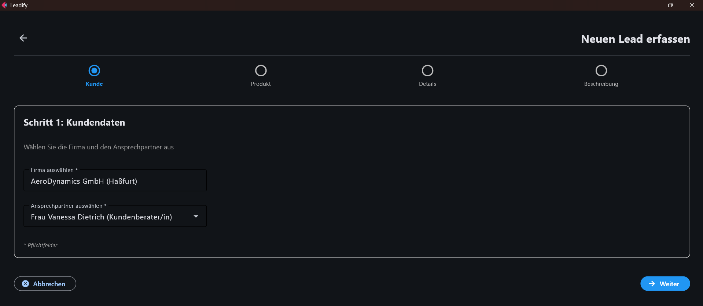
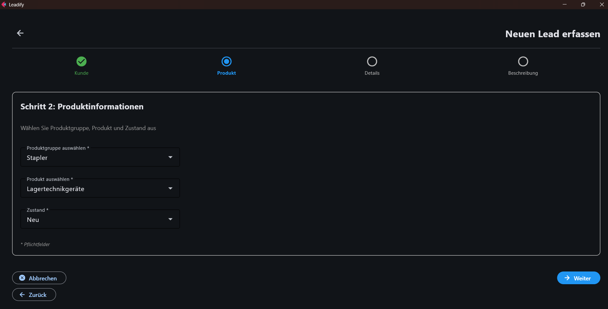
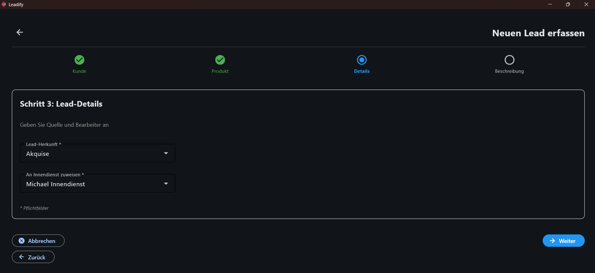
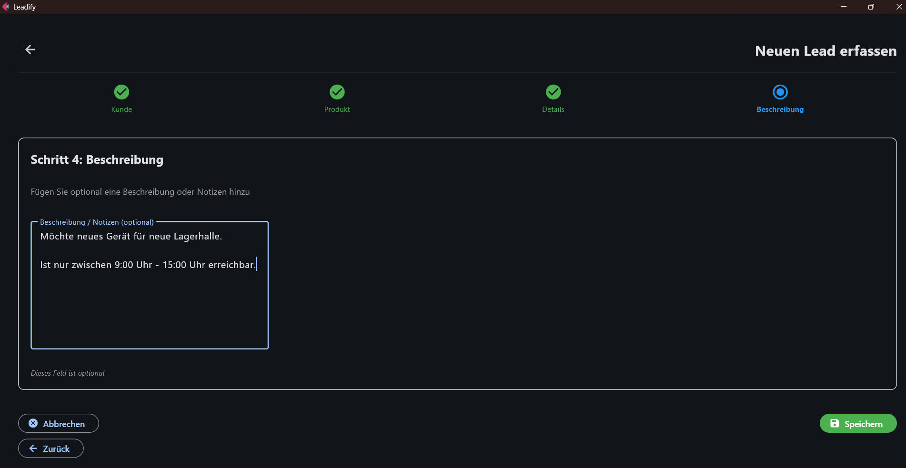
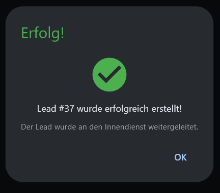

# 2. Leads erstellen 

In diesem Kapitel wird gezeigt, wie ein neuer Lead im Außendienst strukturiert erfasst und an den Innendienst übergeben wird.

Die Erfassung erfolgt in einem 4-Schritt-Formular:

- Kunde
- Produkt
- Details
- Beschreibung

---

# Zweck der Lead-Erstellung

Mit der Lead-Erstellung wird ein neuer Bedarf aus dem Kundenkontakt dokumentiert und direkt an einen zuständigen Innendienst-Mitarbeiter übergeben.

Dadurch ist sichergestellt, dass:

- der Kontakt nachvollziehbar erfasst ist
- ein Bearbeiter eindeutig zugewiesen wird
- der weitere Workflow ohne Medienbruch starten kann

---

# Schritt 1: Kunde auswählen

In diesem Schritt werden Firma und Ansprechpartner festgelegt.

Pflichtfelder:

- Firma auswählen
- Ansprechpartner auswählen

Vorgehen:

1. Öffnen Sie den Bereich **Lead erstellen**.
2. Suchen Sie im Feld **Firma auswählen** nach der passenden Firma.
3. Wählen Sie den richtigen Eintrag aus der Vorschlagsliste.
4. Wählen Sie anschließend im Feld **Ansprechpartner auswählen** die zuständige Kontaktperson.

Hinweis:

- Die Ansprechpartner-Liste wird automatisch auf Basis der gewählten Firma geladen.

---

# Schritt 2: Produktinformationen erfassen

In diesem Schritt wird der konkrete Bedarf beschrieben.

Pflichtfelder:

- Produktgruppe auswählen
- Produkt auswählen
- Zustand auswählen (falls sichtbar)

Vorgehen:

1. Wählen Sie die passende Produktgruppe.
2. Wählen Sie das zugehörige Produkt.
3. Wählen Sie den Zustand des Produkts.

Wichtig:

- Bei der Produktgruppe **Serviceleistungen** ist kein Zustand erforderlich.

---

# Schritt 3: Lead-Details setzen

In diesem Schritt wird festgelegt, woher der Lead kommt und wer ihn intern übernimmt.

Pflichtfelder:

- Lead-Herkunft
- An Innendienst zuweisen

Vorgehen:

1. Wählen Sie im Feld **Lead-Herkunft** den passenden Ursprung (z. B. Messe, Telefon, Empfehlung).
2. Wählen Sie im Feld **An Innendienst zuweisen** den zuständigen Bearbeiter.

---

# Schritt 4: Beschreibung ergänzen

Dieses Feld ist optional.

Empfehlung:

- Tragen Sie kurze, relevante Informationen ein, z. B. Bedarf, Terminwunsch oder Besonderheiten aus dem Gespräch.

---

# Lead speichern

Nach Abschluss aller Schritte:

1. Klicken Sie auf **Speichern**.
2. Das System prüft alle Pflichtfelder.
3. Bei erfolgreicher Prüfung wird der Lead erstellt.
4. Der Lead wird automatisch an den ausgewählten Innendienst weitergeleitet.

Ergebnis:

- Der Lead erhält eine eindeutige Lead-ID.
- Der weitere Bearbeitungsprozess kann im Innendienst starten.

---

# Häufige Hinweise

- **Pflichtfeld fehlt**: Ein benötigtes Feld ist nicht gesetzt. Bitte alle Pflichtfelder ausfüllen.
- **Kein Ansprechpartner sichtbar**: Prüfen, ob zuerst eine Firma korrekt gewählt wurde.
- **Kein Produkt sichtbar**: Produktgruppe prüfen und erneut auswählen.

---

# Kurz-Check vor dem Speichern

- Firma gesetzt
- Ansprechpartner gesetzt
- Produktgruppe gesetzt
- Produkt gesetzt
- Zustand gesetzt (falls erforderlich)
- Lead-Herkunft gesetzt
- Innendienst-Bearbeiter gesetzt

Wenn alle Punkte erfüllt sind, kann der Lead ohne Rückfrage gespeichert werden.
