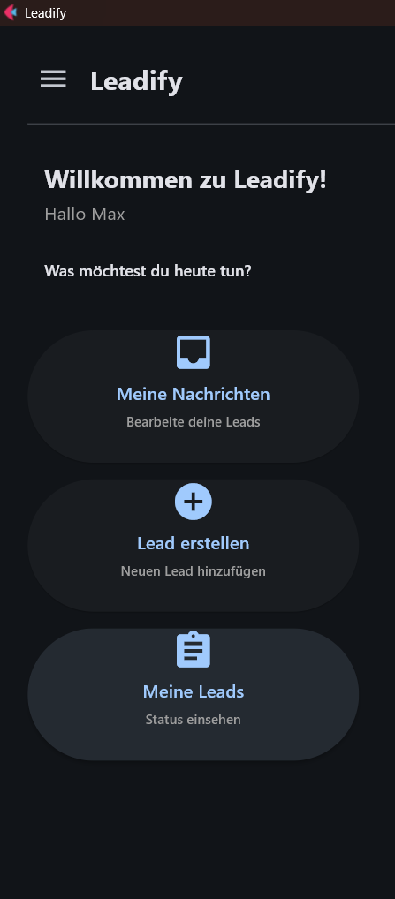
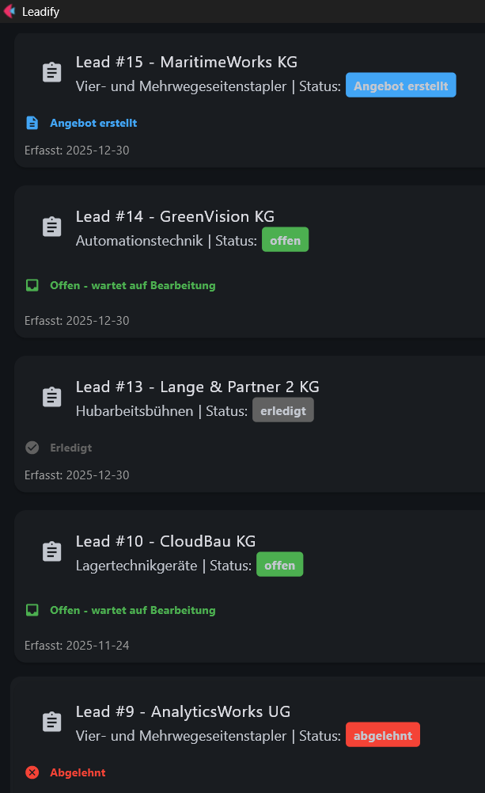
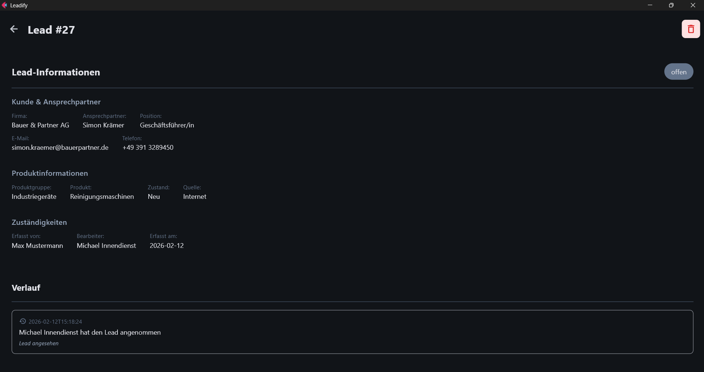
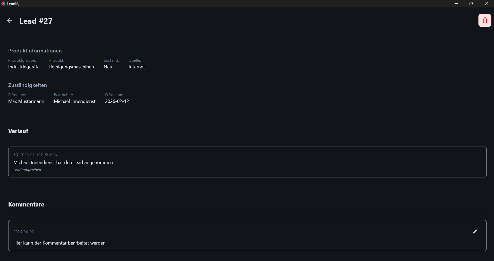
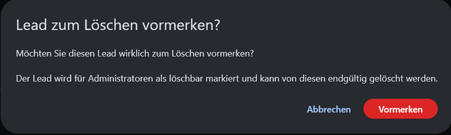
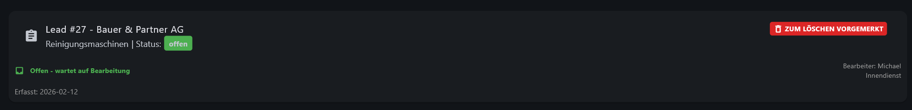

# 4. Meine Leads

Im Menü **„Meine Leads“** erhalten Sie eine Übersicht über alle Leads, die Sie selbst erstellt haben.  
Hier können Sie den aktuellen Status einsehen, Detailinformationen aufrufen sowie bestimmte Aktionen wie das Bearbeiten von Kommentaren oder das Vormerken zur Löschung durchführen.

---

# Lead-Übersicht

In dieser Ansicht werden alle erstellten Leads des angemeldeten Benutzers angezeigt.

Standardmäßig ist ein Filter auf **„offene Leads“** gesetzt.  
Um weitere Stati einzusehen (z. B. abgeschlossene oder in Bearbeitung befindliche Leads), kann der Filter individuell angepasst werden.

Die Übersicht ermöglicht es Ihnen:

- den aktuellen Bearbeitungsstand Ihrer Leads auf einen Blick zu erkennen  
- schnell zwischen verschiedenen Leads zu navigieren  
- gezielt nach bestimmten Stati zu filtern  

Alle Daten werden **in Echtzeit aktualisiert**, sodass Sie jederzeit mit dem aktuellen Stand arbeiten.

Durch Auswahl eines Leads gelangen Sie in die Detailansicht.

---

# Lead-Detailansicht

In der Detailansicht stehen Ihnen sämtliche Informationen zu einem Lead zur Verfügung.

Dazu gehören unter anderem:

- Stammdaten des Kunden  
- aktuelle Statusinformationen  
- bisheriger Verlauf der Bedarfsmeldung  
- hinterlegte Kommentare  

Diese Ansicht dient als zentrale Informationsquelle für die weitere Bearbeitung des Leads.

---

# Kommentare bearbeiten

Solange sich ein Lead im Status **„offen“** befindet, können Sie den beim Erstellen hinterlegten Kommentar nachträglich anpassen.

Dies ist insbesondere hilfreich, wenn:

- zusätzliche Informationen ergänzt werden sollen  
- bestehende Angaben präzisiert werden müssen  

Zum Bearbeiten gehen Sie wie folgt vor:

1. Öffnen Sie die Detailansicht des entsprechenden Leads  
2. Navigieren Sie zur Kommentarsektion  
3. Klicken Sie auf das Bearbeitungssymbol  

Nach der Anpassung wird der Kommentar entsprechend aktualisiert gespeichert.

---

# Leads zum Löschen vormerken

Ein direktes Löschen von Leads durch Mitarbeiter ist **nicht möglich**, um die Nachvollziehbarkeit sowie die Qualität von Auswertungen und Reports sicherzustellen.

Stattdessen können Leads zur Löschung vorgemerkt werden.

## Vorgehensweise

1. Öffnen Sie die Detailansicht des gewünschten Leads  
2. Klicken Sie auf das Mülleimer-Symbol 
3. Bestätigen Sie die angezeigte Sicherheitsabfrage  

Nach der Bestätigung wird der Lead als „zum Löschen vorgemerkt“ markiert.

---

## Kennzeichnung vorgemerkter Leads

Vorgemerkte Leads werden in der Übersicht entsprechend gekennzeichnet.

---

## Endgültige Löschung

Die endgültige Entfernung eines Leads aus dem System erfolgt ausschließlich durch einen Administrator.

Dies gewährleistet:

- Schutz vor unbeabsichtigtem Datenverlust  
- Konsistenz der Datenbasis  
- korrekte Auswertungen und Reportings  

Weitere Informationen finden Sie im Kapitel:  
[Admin Portal](6. Admin-Portal.md)