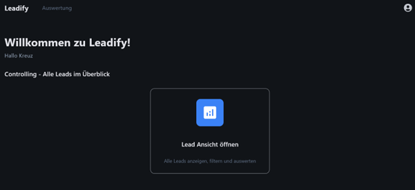
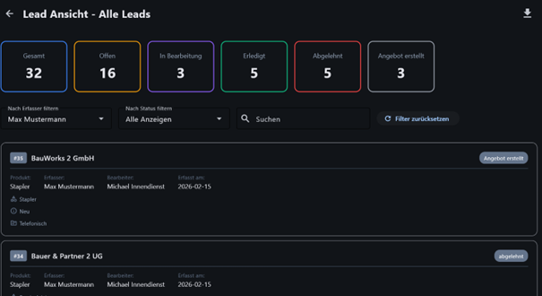

# 5. Reporting

Nach der Anmeldung mit der Rolle „Auswertung“ wird diese Oberfläche angezeigt.
Sie dient dazu, einen Überblick über wichtige Kennzahlen zu erhalten.
Rechts befindet sich das Benutzermenü (Konto verwalten, Abmelden, Design wechseln).
In der Mitte befindet sich die Schaltfläche „Lead-Ansicht öffnen“, über die die Detailauswertung aufgerufen wird.

In dieser Ansicht werden die wichtigsten Kennzahlen übersichtlich dargestellt. Diese sind farblich hervorgehoben.
Oben rechts befindet sich ein Download-Button, über den alle Daten als Excel-Datei exportiert werden können.
Unterhalb der Kennzahlen befinden sich verschiedene Filter:

•	Mitarbeiter-Dropdown: Auswahl eines bestimmten Mitarbeiters oder aller Mitarbeiter 
•	Status-Dropdown: Filter nach Auftragsstatus (z. B. „Angebot erstellt“) 
•	Suchfeld: Direkte Suche nach einem bestimmten Lead 
•	Zurücksetzen: Alle gesetzten Filter können zurückgesetzt werden 

Darunter wird eine Liste der Leads angezeigt, die per Mausrad durchsucht werden kann.
