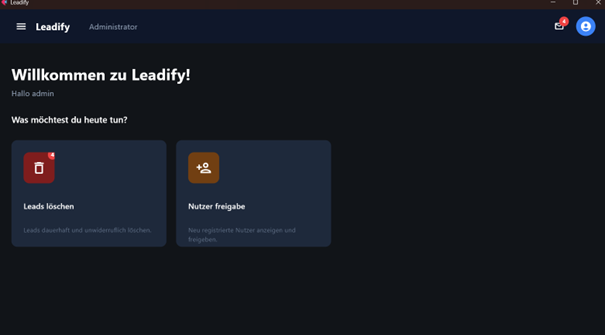
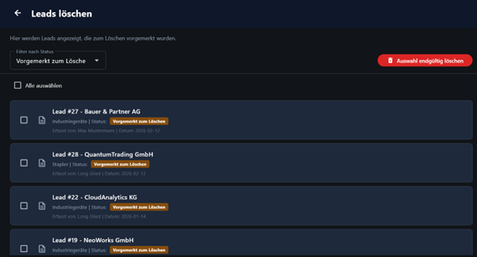
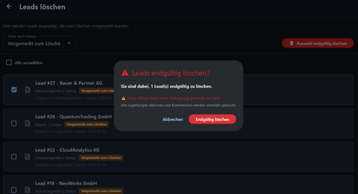
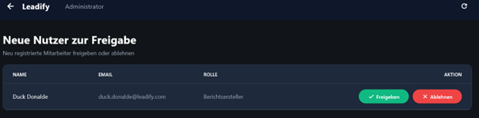

# 6. Admin Portal

Das **Admin Portal** ist ausschließlich für Benutzer mit administrativen Rechten zugänglich.  
Es dient zur Verwaltung von Systemdaten sowie zur Kontrolle sicherheitsrelevanter Prozesse.

---

# Startansicht

Nach der Anmeldung mit einem Administrator-Konto gelangen Sie in die Startansicht des Admin-Portals.

## Aufbau der Oberfläche

Die Benutzeroberfläche ist in mehrere Bereiche unterteilt:

- **Hamburger-Menü (links):**  
  Dient als Navigation zwischen den Hauptfunktionen des Admin-Portals.

- **Aktuelle Ansicht (zentral):**  
  Zeigt den aktuell geöffneten Bereich (z. B. „Administrator“).

- **Benutzermenü (rechts):**  
  Bietet folgende Funktionen:
  - Kontoverwaltung  
  - Abmeldung  
  - Wechsel zwischen Light- und Dark-Mode  

- **Benachrichtigungsbereich:**  
  Zeigt an, wie viele offene Aufgaben oder neue Meldungen vorhanden sind.

---

## Schnellzugriffe

Unterhalb der Navigationsleiste befinden sich zwei zentrale Aktionsbereiche:

- **Leads löschen**  
  Zeigt die Anzahl der zur Löschung vorgemerkten Leads an und führt zur Löschverwaltung.

- **Nutzerfreigabe**  
  Zeigt neu registrierte Benutzer an, die noch freigegeben werden müssen.

---

# Leads endgültig löschen

In diesem Bereich können vorgemerkte Leads endgültig aus dem System entfernt werden.

## Funktionen der Ansicht

- **Filter (Dropdown links oben):**  
  Ermöglicht die Auswahl bestimmter Kategorien oder Einträge.

- **Mehrfachauswahl:**  
  Über eine Auswahloption können mehrere Leads gleichzeitig markiert werden.

- **Löschaktion:**  
  Über die entsprechende Schaltfläche können alle ausgewählten Leads gelöscht werden.

- **Liste der vorgemerkten Leads:**  
  Zeigt alle zur Löschung markierten Einträge in einer scrollbaren Übersicht.

---

## Löschvorgang bestätigen

Beim Ausführen der Löschaktion erscheint ein Bestätigungsdialog.

Dieser dient dazu, unbeabsichtigte Löschvorgänge zu vermeiden.

- Erst nach Bestätigung über die Schaltfläche **„Endgültig löschen“** wird der Lead dauerhaft aus dem System entfernt.

---

# Nutzerfreigabe

In diesem Bereich werden neu registrierte Benutzer angezeigt, die noch nicht freigegeben wurden.

## Vorgehensweise

Für jeden Benutzer können folgende Aktionen durchgeführt werden:

- **Freigeben (grüne Schaltfläche):**  
  Der Benutzer erhält Zugriff auf das System.

- **Ablehnen (rote Schaltfläche):**  
  Der Benutzer wird nicht freigeschaltet.

Vor der Entscheidung sollten die angezeigten Benutzerdaten geprüft werden, um sicherzustellen, dass nur berechtigte Personen Zugriff erhalten.

---

# Ziel des Admin-Portals

Das Admin-Portal stellt sicher, dass:

- nur autorisierte Benutzer Zugriff auf das System erhalten  
- Daten kontrolliert und nachvollziehbar gelöscht werden  
- die Integrität und Sicherheit der Anwendung gewährleistet bleibt  